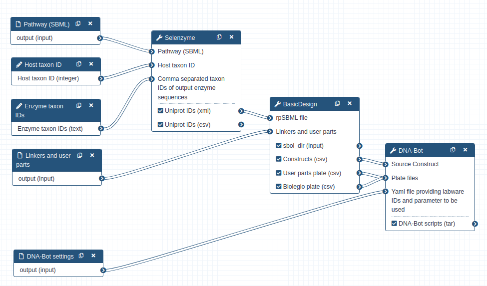
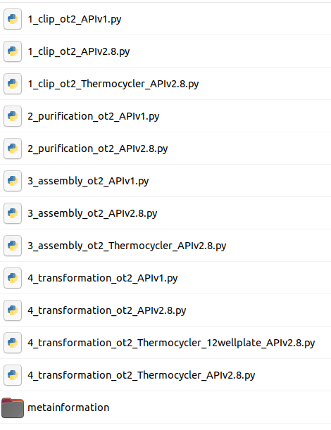

# Introduction
{:.no_toc}

Synthetic biology is a novel engineering discipline which requires computational tools for the design of metabolic pathways for the production of chemicals.

In this tutorial, we will use a set of tools from the **Genetic Design - BASIC Assembly Workflow** (https://galaxy-synbiocad.org) which will enable you to design plasmids implementing metabolic pathways for the bioproduction of lycopene in _E.coli_ using the [BASIC assembly method](https://doi.org/10.1021/sb500356d), and to generate scripts enabling the automatic build of these plasmids using an Opentrons liquid handler robot. After downloading these scripts onto a computer connected to an Opentrons, one can perform the automated construction of the plasmids at the bench.

The workflow scheme we will use is shown below. First, we will run the steps of this workflow individually so as not to neglect the understanding of the intermediate steps as well. Then, we will run the workflow automatically so that it itself retrieves the outputs from the previous step and gives them as input to the next tool.



> ### Agenda
>
> In this tutorial, we will cover:
>
> 1. TOC
> {:toc}
>
{: .agenda}

# Data Preparation

First we need to upload and prepare the following inputs to analyze:

- One SBML file modeling a heterologous pathway producing lycopene such as those produced by the Pathway Analysis Workflow (https://galaxy-synbiocad.org).

- "parts_for_lycopene.csv" file listing the parts to be used (linkers, backbone and promoters) in the constructions.

- Two YAML files providing two examples of settings, i.e. providing the identifiers of the laboratory equipment and the parameters to be used in the Opentrons scripts.

## Get data

> ###  Hands-on: Data upload
>
> 1. Create a new history for this tutorial named *Genetic Design - BASIC Assembly Analysis*.
> 2. Import the input files from [Zenodo]({{ page.zenodo_link }}):
>
>    ```
>    https://zenodo.org/api/files/f58fe126-0ca2-4ca5-bc4b-0063f3a8951c/dnabot_london_settings.yaml
>    https://zenodo.org/api/files/f58fe126-0ca2-4ca5-bc4b-0063f3a8951c/dnabot_paris_settings.yaml
>    https://zenodo.org/api/files/f58fe126-0ca2-4ca5-bc4b-0063f3a8951c/parts_for_lycopene.csv
>    https://zenodo.org/api/files/f58fe126-0ca2-4ca5-bc4b-0063f3a8951c/rp_002_0011.xml
>    ```
>
>    
>
> 3. Rename the datasets if you want to shorten the file names.
>
>    
>
{: .hands_on}

# Find enzymes using **Selenzyme**

At first, a pathway generated by the Pathway Analysis workflows (https://galaxy-synbiocad.org) is provided as an SBML file to the [Selenzyme](https://doi.org/10.1093/bioinformatics/bty065) tool. Selenzyme searches for enzymes corresponding to each reaction of the pathway. It performs a reaction similarity search in the reference reaction database [MetaNetX](https://www.metanetx.org) and outputs an updated SBML file annotated with the enzyme UniProt IDs.

> ###  Hands-on: Task description
>
> 1. Run  with the following parameters:
>    -  *"Pathway (SBML)"*: Select rp_002_0011.xml from your current history
>    - In *"Advanced Options"*:
>        - *"Host taxon ID"*: Leave the default value `83333`. This stands for using E. coli as the chassis host.
>        - *"Comma separated taxon IDs of output enzyme sequences"*: *enter `553` which is the taxon ID of the Pantoea ananatis strain from which we want to extact enzymes*
>
>    > ###  Comment
>    >
>    > This tool will produce annotated pathway with UniProt IDs in XML and CSV format.
>    {: .comment}
>
{: .hands_on}

> ###  Questions
>
> 1. How are identified the enzyme in the SBML file?
>
> > ###  Solution
> >
> > 1. Enzyme are identified by their UniProt ID
> >
> {: .solution}
>
{: .question}

# Converting SBML file to CSV files using **BasicDesign**

Second, the BasicDesign tool converts the SBML file into CSV files describing the DNA-parts to be included into each construct (in an operon format) and enumerate possible combinations of promoters, RBSs and enzymes into constructs. Depending on the numbers of enzymes per reaction, of RBSs and promoters available, and whether or not to perform CDS permutation within the operon, the number of constructs may vary.

> ###  Hands-on: Task description
>
> 1. Run  with the following parameters:
>    -  *"rpSBML file": `uniprot_ids` (output of **Selenzyme**  in xml format)*
>    - In *"Advanced Options"*:
>        -  *"Linkers and user parts": Select `parts_for_lycopene.csv` from your current history in csv format*
>
>    > ###  Comment
>    >
>    > This tool will output a CSV constructs file, where each row corresponds to one construct and consists of a sequence of BASIC linker and DNA part IDs. The two other outputted CSV files provide the plate coordinates of (i) the BASIC linkers and (ii) the DNA-parts that the user will need to provide. Additionally, one SBOL file is produced for each construct generated.
>    {: .comment}
>
{: .hands_on}

> ###  Questions
>
> 1. How many constructs did you get ?
>
> > ###  Solution
> >
> > 1. 88 construct designs were generated in CSV and SBOL format.
> >
> {: .solution}
>
{: .question}

# Generating python scripts using **DNA-Bot**

 In the last step, the DNA-Bot tool reads the list of constructs and the DNA-parts position on the source plates and generates a set of python scripts to build the plasmids using an Opentrons liquid handling robot.

> ###  Hands-on: Task description
>
> 1. Run  with the following parameters:
>    -  *"Source Construct"*: `Constructs` (output of **BasicDesign** )
>    -  *"Plate files"*: Select these two files: `User parts plate` (output of **BasicDesign** ), `Biolegio plate` (output of **BasicDesign** ) with **Multiple datasets**.
>    - In *"Advanced Options"*:
>        -  *"Yaml file providing labware IDs and parameter to be used (Optionally)"*: Select either `dnabot_paris_settings.yaml` or `dnabot_london_settings.yaml` from your history)
>
>
>
>    > ###  Comment
>    >
>    > This tool will output DNA-Bot scripts in tar format. You need to download it and decompress the archive. After downloading these scripts onto a computer connected to an Opentrons, one can perform the automated construction of the plasmids at the bench.
>    > 
>    {: .comment}
>
{: .hands_on}

> ###  Questions
>
> 1. Looking at the scripts names, can you figure out the main steps of DNA-Bot ?
>
> > ###  Solution
> >
> > 1. DNA-Bot outputs python scripts that implement the 4 assembly steps: clip reactions, purification, assembly and strain transformation. 
> >
> {: .solution}
>
{: .question}

# Run the **Genetic Design - BASIC Assembly Workflow**

In this section, you can run the Genetic Design - BASIC Assembly Workflow more easily and fastly following these instructions:

> ###  Hands-on: Task description
>
> 1. Import your **Genetic Design - Basic Assembly Workflow** by uploading the workflow file using the following **URL link** : https://training.galaxyproject.org/training-material/topics/synthetic-biology/tutorials/basic_assembly_analysis/workflows/Genetic_Design_BASIC_Assembly.ga.
>
>    
>
> 2. Click on *Workflow* on the top menu bar of Galaxy. You will see **Genetic Design - Basic Assembly Workflow**
> 3. Click on the  (*Run workflow*) button next to your workflow
> 4. Provide the workflow with the following parameters:
>    -  *"Pathway (SBML)":* Select rp_002_0011.xml from your current history
>    - *"Host taxon ID"*: Leave the default value `83333`. This stands for using E. coli as the chassis host.
>    - *"Comma separated taxon IDs of output enzyme sequences"*: enter `553` which is the taxon ID of the Pantoea ananatis strain from which we want to extact enzymes
>    -  *"Linkers and user parts": Select `parts_for_lycopene.csv` from your current history in csv format*
>    -  *"DNA-Bot settings (Optionally)"*: Select either `dnabot_paris_settings.yaml` or `dnabot_london_settings.yaml` from your history)
>
>    > ###  Comment
>    >
>    > All the outputs will be automatically generated and identical to the previous ones. 
>    {: .comment}
>

{: .hands_on}

{:.no_toc}